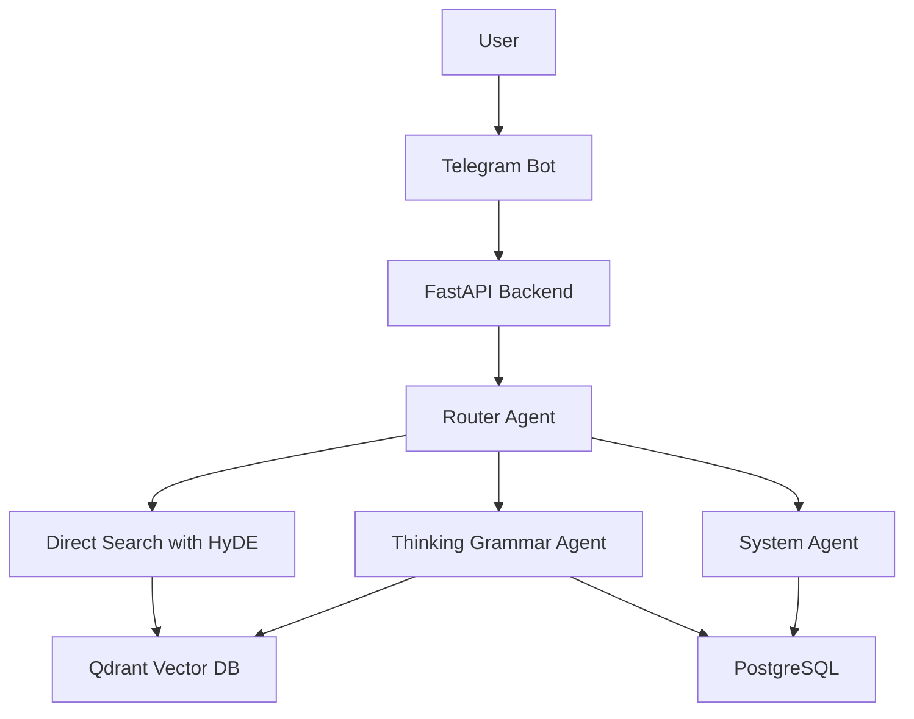

# Korean Learning Chatbot

A sophisticated **multi-agent Korean language learning chatbot** powered by LLMs, featuring advanced semantic search and interactive Telegram interface. Built with modern Python stack including FastAPI, Aiogram 3.x, Qdrant vector database, and OpenAI GPT-4.


## 🚀 Features

### Multi-Agent Intelligence
- **Router Agent**: Intelligently classifies user messages into appropriate response types
- **Grammar Agent**: Provides detailed explanations with RAG-based document retrieval
- **System Agent**: Handles casual conversations and general bot interactions
- **Direct Grammar Search** (not an agent, but important): Provides direct grammar search functionality

### Advanced Search Capabilities
- **Hybrid Vector Search**: Combines dense embeddings, sparse (BM25), and late interaction models
- **Reciprocal Rank Fusion (RRF)**: Optimal result ranking across multiple search methods

### Rich User Experience
- **Interactive Telegram Interface**: Modern bot with inline keyboards and state management
- **Grammar Selection Flow**: Multi-step interactive selection for precise results
- **Conversation History**: Persistent chat history with selective clearing

### Robust Architecture
- **Async/Await Throughout**: High-performance asynchronous processing
- **PostgreSQL Database**: Reliable user management and message storage
- **Qdrant Vector Database**: High-performance semantic search engine
- **Docker Containerization**: Easy deployment and development setup
- **Observability**: Integrated logging and monitoring with Logfire

## 🏗️ Architecture



### Core Components

1. **Telegram Bot** (`src/tgbot/`)
   - Modern Aiogram 3.x framework with FSM
   - Interactive keyboards and state management
   - Rich message formatting with Korean text support

2. **FastAPI Backend** (`src/api/`)
   - REST API orchestrating LLM agents
   - Async endpoints with proper error handling
   - OpenAI integration and observability

3. **Multi-Agent LLM System** (`src/llm_agent/`)
   - PydanticAI framework for agent coordination
   - Specialized agents for different response types
   - RAG-based document retrieval with dependency injection

4. **Vector Database** (`src/qdrant_db/`)
   - Multiple embedding models and collections
   - Hybrid search with dense, sparse, and late interaction

5. **PostgreSQL Database** (`src/db/`)
   - User management
   - Message history
   - Async SQLAlchemy ORM with migrations

## 🛠️ Technology Stack

- **Backend**: FastAPI, Python 3.12+, Pydantic AI
- **Bot Framework**: Aiogram 3.x with FSM
- **Databases**: PostgreSQL 15, Qdrant vector database, Redis
- **LLM**: OpenAI GPT-4.1, GPT-4.1-mini
- **Embeddings**: OpenAI text-embedding-3-small/large, JinaAI models
- **DevOps**: Docker Compose, Alembic migrations, UV package manager
- **Monitoring**: Logfire observability platform

## 🚀 Quick Start

### Prerequisites

- Python 3.12+
- Docker and Docker Compose
- OpenAI API key
- Telegram Bot Token

### Installation

1. **Clone and setup environment**:
```bash
git clone <repository-url>
cd korean_learning_chatbot
cp .env.example .env  # Configure your environment variables
```

2. **Install dependencies**:
```bash
# Using UV (recommended)
curl -LsSf https://astral.sh/uv/install.sh | sh
uv sync

# Or using pip
pip install -e .
```

3. **Configure environment variables** in `.env`:
```env
BOT_TOKEN=your_telegram_bot_token
OPENAI_API_KEY=your_openai_api_key
ADMIN_IDS=123456789,987654321
POSTGRES_HOST=localhost
POSTGRES_PORT=5433
POSTGRES_DB=korean_bot
POSTGRES_USER=user
POSTGRES_PASSWORD=password
KRDICT_API_KEY=your_krdict_api_key
LOGFIRE_API_KEY=your_logfire_api_key
```

4. **Start services**:
```bash
# All services with Docker
docker compose up

# Or individually for development
docker compose up postgres redis qdrant  # Dependencies only
uv run python -m src.api.main             # API server
uv run python -m src.tgbot.bot            # Telegram bot
```

5. **Run database migrations**:
```bash
alembic upgrade head
```

## 📖 Usage

### Basic Commands

- `/start` - Initialize bot and register user
- `/help` - Show available commands and features
- `/clear_history` - Clear conversation history
- `/vocab <word>` - Look up Korean word in dictionary

### Grammar Search

Simply type Korean grammar patterns or questions:

- **Direct search**: "까지", "고 싶다", "았/었"
- **Meaning search**: "Korean future tense", "how to say 'want to'"
- **Example search**: "가고 싶어요" (finds the "고 싶다" pattern)
- **Questions**: "What's the difference between 는/은 and 이/가?"

## 🔧 Development

### Project Structure

```
src/
├── api/           # FastAPI backend
├── tgbot/         # Telegram bot frontend
├── llm_agent/     # Multi-agent LLM system
├── qdrant_db/     # Vector database operations
├── db/            # PostgreSQL database layer
├── utils/         # Data processing utilities
├── schemas/       # Pydantic models
└── config/        # Configuration management

data/
├── grammar-level-1/     # Korean grammar rules
└── howtostudykorean/    # Lesson content
```

### Development Commands

```bash
# Run individual components
uv run python -m src.tgbot.bot          # Telegram bot
uv run fastapi dev src/api/main.py       # API server (with hot reload)

# Database operations
alembic revision --autogenerate -m "message"  # Create migration
alembic upgrade head                           # Apply migrations

# Code quality
ruff check .                             # Linting
ruff format .                           # Code formatting
```

### Adding New Features

1. **New Agent**: Define in `src/llm_agent/agent.py` with appropriate tools
2. **Bot Handler**: Add to `src/tgbot/handlers/` with proper routing
3. **API Endpoint**: Create in `src/api/routers/` with validation
4. **Database Changes**: Use Alembic migrations in `alembic/versions/`

## 📊 Data Pipeline

### Content Processing

1. **Grammar Rules**: Markdown files in `data/grammar-level-1/` processed and embedded
2. **Lesson Content**: `data/howtostudykorean/` lessons chunked and vectorized
3. **Embeddings**: Multiple models create diverse representations
4. **Vector Storage**: Qdrant collections optimized for Korean language search

### Search Process

1. **Query Classification**: Router agent determines response type
2. **Query Enhancement**: HyDE generates hypothetical answers for better search
3. **Hybrid Retrieval**: Dense + sparse + late interaction model fusion
4. **Result Ranking**: RRF combines and ranks results optimally
5. **Response Generation**: Appropriate agent generates contextual response

## 🚀 Deployment

### Docker Production

```bash
# Build and deploy
docker compose -f compose.yml up -d

# Scale services
docker compose up --scale api=2 --scale tgbot=1
```

### Environment Setup

- **Development**: Local Python with Docker dependencies
- **Staging**: Full Docker deployment with external databases
- **Production**: Kubernetes or Docker Swarm with monitoring

### Code Standards

- **Type Hints**: All functions must have complete type annotations
- **Async/Await**: Use async patterns consistently throughout
- **Error Handling**: Proper exception handling with logging
- **Documentation**: Docstrings for complex functions
- **Testing**: Unit tests for new features and bug fixes

## 📝 License

This project is licensed under the MIT License - see the [LICENSE](LICENSE) file for details.

## 🙏 Acknowledgments

- [HowToStudyKorean.com](https://howtostudykorean.com) for comprehensive lesson content